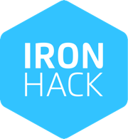

MID PROJECT 1

Introducción

Este proyecto consiste en crear una réplica EXACTA de un sitio web proporcionado por Figma con las herramientas aprendidas hasta el momento (HTML, CSS, JS).

Desafío

El principal desafío consta de varios puntos de los cuales 3 muy importante; que sea "responsive", mantener los principios KISS (Keep It Simple Stupid) y DRY (Don't Repeat Yourself) y visualizarse en un navegador.

Contenido

El proyecto consta de 3 páginas HTML con sus respectivos archivos CSS correctamente enlazados.
Con el objetivo de mejorar la organización del código se añadió 3 archivos CSS;
-main: contiene las características universales que utiliza en el sitio web como; el menú y el pie de página.
-\_font: contiene la tipografía.
-\_colors: contiene la gamma de colores del diseño del sitio web.
Así mismo se enlazó correctamente las páginas HTML entre ellas y como detalle final se implementó el proyecto en la plataforma NETLIFY con el objetivo de convertirlo en un sitio web en línea y listo para interactuar con él.

Conclusión

El proceso ha sido largo y complicado. Sin duda una odisea que con mucho trabajo ha llegado a un puerto.
Un proyecto sin duda muy dinámico y perfecto para aprender a introducirse al FRONT-END como futuro desarrollador.
